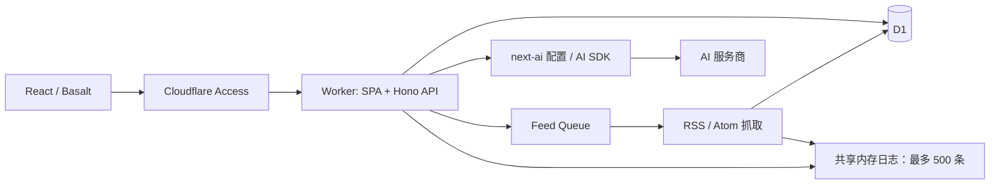

# 架构

GeekHub 是单用户应用。Cloudflare Access 控制入口；订阅、文章状态、偏好和 AI 设置共用一份数据，不按 Access subject 或历史 `user_id` 分区。

## 边界

- `src/web` 只运行在浏览器；通过 `/api/*` 读写数据。TanStack Query 管理服务端状态。
- `App`、`Reader`、`ReaderContent`、`Panels`、`Subscriptions`、`FeedDiagnostics` 负责视图、表单、焦点与滚动；`reader-view-model.ts` 和 `panels-view-model.ts` 负责查询、写入、后台活动和诊断轮询。View 不决定何时重载文章数据。
- `src/worker` 只运行在 Worker；持有 D1、Queue 和密钥 binding。API 返回数据与必要的业务错误，不返回凭据。
- `src/shared` 是浏览器安全的契约与校验。AI `/server` 入口不进入浏览器依赖图。
- Basalt 提供 AppShell、Sidebar、AppHeader、ContentIsland、弹窗和通知；业务 CSS 使用库的 tokens，不重定义 `--basalt-*`。

## 数据

| 表 | 内容 |
| --- | --- |
| `categories` | 分类名称、颜色、图标、排序 |
| `feeds` | RSS／主站地址、分类、排序、自动翻译、更新间隔、启停、租约、任务令牌、抓取版本、失败次数 |
| `articles` | 内容、来源 ID、已读／收藏／稍后阅读、AI 结果 |
| `settings` | 固定 `id=1`，阅读偏好、AI 配置、加密凭据 |
| `feed_diagnostics` | 每个源最近一次诊断的运行 ID、原地址、状态、时间和 JSON 报告；删除订阅时级联清理 |
| `directory` | 精选博客、RSS 地址、标签、评分和导出元数据 |

抓取日志通过一个固定名称的 `FeedLogCache` Durable Object 共享，仅在内存保留最新 500 条，按写入顺序倒序返回；不调用 D1、DO storage 或文件系统。Queue 和 API 访问同一实例，实例回收或重新部署后历史会清空。筛选、清空和日志数量统计均使用该缓存；写日志失败不影响抓取状态或 Queue ack。旧 `fetch_logs` 通过迁移清空，空表仅用于发布期间兼容旧 Worker，不再读写，也没有按时间扫描清理。

没有账户数据表，也没有文件系统文章缓存。所有在线 SQL 参数均绑定，文章状态与偏好按提交字段原子更新。外键负责删除订阅后的文章级联和删除分类后的未分类状态。清理旧文章始终保留收藏与稍后阅读。

文章以 `(feed_id, source_id)` 去重，重复队列投递不会清空阅读状态。列表按发布时间与 ID 做 keyset 分页。RSSHub 地址保留 `rsshub://` 形式，每次抓取从当前偏好解析实例 URL。

## 阅读中的更新

进入新的视图、分类、订阅或搜索条件时，ViewModel 创建一次阅读访问。文章列表保留该次访问的分页快照；抓取日志、计数与订阅状态可以独立轮询，窗口重新获得焦点或网络恢复也不会重载列表和当前正文。

`reader-navigation.ts` 解析来源／分类／文章路径和阅读筛选，原生 History API 负责前进后退；历史项携带阅读访问标识，优先复用对应快照。刷新从 URL 恢复范围和文章，同一标签页的 `sessionStorage` 保存分页深度及滚动位置，视图在内容就绪后恢复。新导航使旧的异步翻页选择失效，不因旧请求结束再次切换文章。

标记已读、收藏和稍后阅读只合并服务端确认的字段。未读列表中的文章读完后仍留在原位；主动载入或再次进入视图时才按新条件筛选。状态写入与“全部已读”串行提交，避免慢请求颠倒操作顺序；失败保留原有显示并通知用户。

新文章自动合并到列表上方，并以右下角 toast 提示数量；后台标题翻译静默更新。视图保留可见文章及其相对位置，在新列表提交后恢复滚动锚点。正文 DOM 只随实际内容或图片偏好改变；阅读状态、抓取活动和后台标题翻译不重建正文。订阅可以在打开文章时自动获取全文，随后再自动翻译；缓存结果直接复用，失败保留现有内容且不循环重试。

## 抓取与 AI

添加、换源、恢复订阅和手动刷新先获得租约，再发送 Queue 消息；已移除 Cron，空闲时不扫描或自动抓取。全部刷新只包含启用的订阅。消费者等待抓取、写入和日志完成后再 ack，失败后有限重试。网络请求有 15 秒超时，检查每次跳转的公开 HTTP(S) 地址，读取正文不超过 4 MiB。RSS 最多处理 200 篇，D1 每批 25 条。

每次入队携带唯一 `refresh_token`。入队、消费、换源或暂停都会递增 `fetch_revision`；文章写入和完成状态必须匹配当前版本。旧消费者即使晚到，也不能污染新地址、覆盖新任务或在删除后重新插入文章。队列失败后仍有限重试。`refresh_minutes` 和 `next_fetch_at` 保留兼容历史数据与 API，但不再驱动自动调度，界面不再提供刷新间隔设置。

诊断同样通过 Queue 执行，结果留在 D1，窗口关闭不取消检查。每个源同一时间复用活动诊断，120 秒未完成允许重新发起。检查总网络时限 55 秒、单请求 10 秒；源正文 4 MiB、主站 HTML 1 MiB；最多检查 6 个候选，每批并发 2 个。时间统计覆盖全部返回条目，缺失、无效和未来日期不参与新鲜度判断；默认 90 天提示可能停更。HTTP 成功但内容为空或不能解析，会分别报告。

重新发现读取主站声明的 RSS／Atom、订阅链接及常见路径，并实际抓取候选验证。RSSHub 缺少原站信息时要求读者补充主站，不把实例服务地址当成网站首页。换源保留订阅 ID、已有文章和状态，清除旧缓存校验头、失效诊断，并重新入队；暂停会取消旧任务，并从全部刷新中排除；仍可单独手动刷新。

HTML 在入库与渲染边界清理，去掉脚本、事件属性、不安全协议和嵌入元素。图片通过受限代理加载，禁止 SVG，限制类型和体积。保留原文链接供抓取受限时阅读。

阅读器在浏览器内用 Turndown 将 HTML 整理为 Markdown，再由 `react-markdown` / GFM 呈现；不执行 Markdown 中的原始 HTML。数据表格保留，布局表格和无法忠实表达的合并单元格展开为顺序内容。图片、图注、链接与代码继续可读；数据库保留原始清洗结果。Markdown 模块按需加载，正文转换缓存不依赖抓取活动与阅读状态。

AI 使用 `@nocoo/next-ai` 的公共契约、React 设置面板和 `/server` 的 `resolveAiConfig` / `createAiModel`，与 Gecko 保持同一调用方式；应用不直接构造 OpenAI / Anthropic 客户端。0.4.0 通过仓库内 Bun 包补丁增加每个客户端独立的 `fetch` 和 `openaiApi` 选项，GeekHub 指定 Chat Completions。传输层使用 Worker 支持的 `redirect: "manual"`，显式拒绝 3xx、限制响应体和超时。凭据以 AES-GCM 加密保存，应用上下文为 AAD；更换服务商或端点会清除旧密钥，防止转发给新站点。默认不自动重试付费请求，全文翻译限制为 45,000 字符。

## 认证与环境

生产校验 Access RS256 JWT 的签名、issuer、audience、有效期、subject 和 email，缺失配置或验证失败即拒绝。单独的身份邮箱 header 不构成认证。写操作检查 Origin 和 Sec-Fetch-Site。

本地身份仅在 `ENVIRONMENT=local` 且回环请求时可用；Caddy 域名还要求回环 peer。生产永不启用该分支。日常本地与生产都使用真实 AI；没有服务商密钥时返回 422。模拟输出仅限 `RESOURCE_ENV=test` 的隔离自动化测试，测试请求还需通过 SQLite `_test_marker` 检查。

健康接口 `/api/live` 在应用认证之前运行，仅报告版本与 D1 可用性。Cloudflare Access 的边缘策略可能额外保护它；公开监控应配置精确到该路径的 bypass，其他路径仍需登录。

## 旧系统对应关系

保留三栏阅读、分类与订阅、发现、RSSHub、全文、翻译、收藏、稍后阅读、偏好、统计和日志。原 Supabase 登录改为 Access；原文件缓存／数据目录管理由 D1 统计与清理替代；原日志 SSE 改为抓取期间轮询。原数据库和托管服务不会因代码归档被删除。
