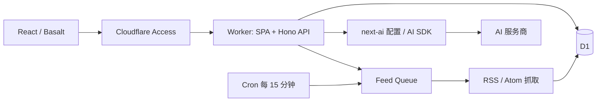

# 架构

GeekHub 是单用户应用。Cloudflare Access 控制入口；订阅、文章状态、偏好和 AI 设置共用一份数据，不按 Access subject 或历史 `user_id` 分区。

## 边界

- `src/web` 只运行在浏览器；通过 `/api/*` 读写数据。TanStack Query 管理服务端状态。
- `src/worker` 只运行在 Worker；持有 D1、Queue 和密钥 binding。API 返回数据与必要的业务错误，不返回凭据。
- `src/shared` 是浏览器安全的契约与校验。AI `/server` 入口不进入浏览器依赖图。
- Basalt 提供 AppShell、Sidebar、AppHeader、ContentIsland、弹窗和通知；业务 CSS 使用库的 tokens，不重定义 `--basalt-*`。

## 数据

| 表 | 内容 |
| --- | --- |
| `categories` | 分类名称、颜色、图标、排序 |
| `feeds` | RSS 地址、分类、自动翻译、更新间隔、启停、抓取状态与租约 |
| `articles` | 内容、来源 ID、已读／收藏／稍后阅读、AI 结果 |
| `settings` | 固定 `id=1`，阅读偏好、AI 配置、加密凭据 |
| `fetch_logs` | 抓取结果与耗时；30 天自动过期 |
| `directory` | 精选博客、RSS 地址、标签、评分和导出元数据 |

没有账户数据表，也没有文件系统文章缓存。所有在线 SQL 参数均绑定，文章状态与偏好按提交字段原子更新。外键负责删除订阅后的文章级联和删除分类后的未分类状态。清理旧文章始终保留收藏与稍后阅读。

文章以 `(feed_id, source_id)` 去重，重复队列投递不会清空阅读状态。列表按发布时间与 ID 做 keyset 分页。RSSHub 地址保留 `rsshub://` 形式，每次抓取从当前偏好解析实例 URL。

## 抓取与 AI

手动刷新先获得租约，再发送 Queue 消息；Cron 每 15 分钟选择到期且启用的订阅，分批入队。消费者等待抓取、写入和日志完成后再 ack，失败后有限重试。网络请求有 15 秒超时，检查每次跳转的公开 HTTP(S) 地址，读取正文不超过 4 MiB。RSS 最多处理 200 篇，D1 每批 25 条。

HTML 在入库与渲染边界清理，去掉脚本、事件属性、不安全协议和嵌入元素。图片通过受限代理加载，禁止 SVG，限制类型和体积。保留原文链接供抓取受限时阅读。

AI 使用 `@nocoo/next-ai` 的公共契约、React 设置面板和 `/server` 配置解析。0.4.0 的模型工厂尚不接收自定义 fetch，因此请求层使用同系列 AI SDK 工厂，统一拒绝带凭据的重定向、限制响应体和超时。凭据以 AES-GCM 加密保存，应用上下文为 AAD；更换服务商或端点会清除旧密钥，防止转发给新站点。默认不自动重试付费请求，全文翻译限制为 45,000 字符。

## 认证与环境

生产校验 Access RS256 JWT 的签名、issuer、audience、有效期、subject 和 email，缺失配置或验证失败即拒绝。单独的身份邮箱 header 不构成认证。写操作检查 Origin 和 Sec-Fetch-Site。

本地身份仅在 `ENVIRONMENT=local` 且回环请求时可用；Caddy 域名还要求回环 peer。生产永不启用该分支。没有配置真实 AI 密钥时，本地返回明确标记的模拟输出。测试环境还需要 `RESOURCE_ENV=test` 和 SQLite `_test_marker`。

健康接口 `/api/live` 在应用认证之前运行，仅报告版本与 D1 可用性。Cloudflare Access 的边缘策略可能额外保护它；公开监控应配置精确到该路径的 bypass，其他路径仍需登录。

## 旧系统对应关系

保留三栏阅读、分类与订阅、发现、RSSHub、全文、翻译、收藏、稍后阅读、偏好、统计和日志。原 Supabase 登录改为 Access；原文件缓存／数据目录管理由 D1 统计与清理替代；原日志 SSE 改为抓取期间轮询。原数据库和托管服务不会因代码归档被删除。
