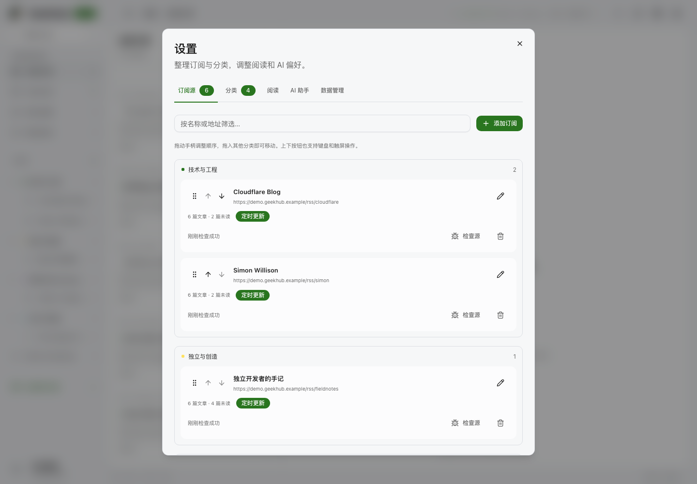
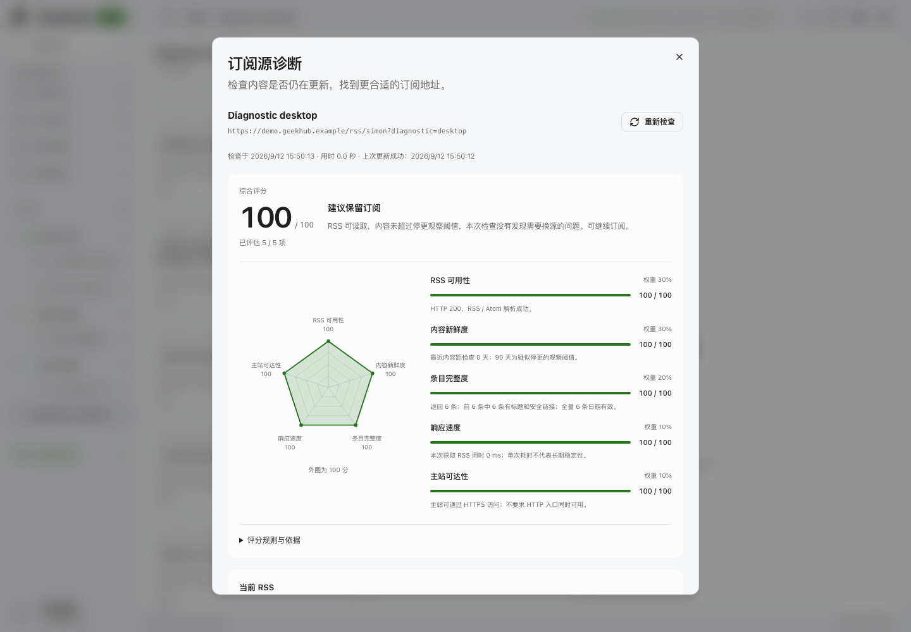

# 阅读更新、订阅管理与源诊断

本轮在 v1.2.1 基础上重写阅读更新和订阅管理，作为 **v1.3.0** 发布。

## 阅读不中断

原实现把已读、收藏、设置保存、源抓取完成和自动翻译都接到统一的查询刷新。未读文章会在点击后立即消失，列表重新排序；正文的回调 ref 还会在普通重渲染时替换全部节点，丢失选区。

现在由 `reader-view-model.ts` 管理查询、状态和写入，视图负责布局、焦点与滚动。每次进入视图保留一个文章快照：阅读状态就地更新，后台抓取和标题翻译只产生“有内容更新”提示。用户点击载入后更新列表，并恢复首个仍存在的可见文章的位置。正文由独立的 Markdown 组件呈现；阅读状态和元数据变化复用正文 DOM，保留选区。后台请求失败会保留已经加载的内容。

`J/K` 和列表方向键切换文章；`/` 搜索，`Esc` 返回，`M/S/L` 切换已读、收藏和稍后阅读，`O` 打开原文，`R` 抓取更新。输入框、输入法组合输入、弹窗、菜单和浏览器组合键不会触发阅读动作；正文中的方向键保持原生滚动。

键盘切换时同步移动文章按钮的 DOM 焦点，再以 `nearest` 保持可见；焦点边框绘制在行内。浏览器前进／后退时，如果焦点原本位于文章列表，也同步到新的选中项。修复了旧按钮仍带着焦点边框、在列表中留下绿色横线的问题。

## 地址与阅读位置

订阅源、分类、文章和筛选条件现在由 URL 表达，使用浏览器原生 History API。

| 阅读范围 | 地址示例 |
| --- | --- |
| 全部文章／未读／收藏／稍后阅读 | `/`、`/?view=unread`、`/?view=starred`、`/?view=later` |
| 单个订阅源 | `/feeds/<feedId>` |
| 一个分类 | `/categories/<categoryId>` |
| 来源中的文章 | `/feeds/<feedId>/articles/<articleId>` |
| 分类内的搜索结果和文章 | `/categories/<categoryId>/articles/<articleId>?q=关键词` |

文章路径也支持 `view` 与 `q`，保留打开它时的阅读范围。切换范围和文章添加历史记录；重复选择同一项不添加记录。浏览器前进／后退优先复用对应列表快照，“返回文章列表”和 Escape 保留当前范围和搜索。旧的 `/?article=...` 链接自动转换为 `/articles/...`，不额外增加历史项。路径中的 ID 和搜索文本正确编码，非法路径安全回到全部文章，文章不存在时仍可返回对应列表。

刷新和历史导航从 URL 恢复当前范围、选中文章；同一标签页还通过 `sessionStorage` 保存列表和正文滚动位置。刷新后按已加载页数补齐长列表，再恢复位置；正文等待 Markdown 出现，并在图片撑开内容时继续尝试尚未完成的定位，用户开始滚动或操作后立即停止自动定位。存储不可用时仍能按 URL 阅读。浏览器标题显示当前文章和来源，便于从历史记录找回。

每个列表阅读快照有独立标识。后台元数据变化不影响它，回到旧快照时仍能看到待载入的更新提示。分页请求完成前发生新导航，即使随后回到同一篇文章，也不能由旧请求擅自切换文章。删除当前源或分类替换当前历史项，避免多出一个已经失效的中间范围。

## Markdown 正文

参考 [Kami 的排版规范](https://github.com/tw93/Kami/blob/main/skills/kami/references/design.md)和 [ocelot 的 Markdown 视图](https://github.com/nocoo/ocelot/blob/main/src/views/Markdown.tsx)，正文采用统一的标题层级、舒适行宽、段落间距和衬线字体选项。保留 GeekHub 的主题与阅读偏好，段落两端对齐，代码与宽表格在自身区域横向滚动。

`reader-markdown.ts` 在浏览器内把已清洗的 HTML 转成 Markdown，使用 Turndown 与 GFM 规则；`ReaderContent.tsx` 用 `react-markdown` / `remark-gfm` 呈现，不执行原始 HTML。原始 HTML 仍保存在 D1，原文、译文和提取全文使用同一显示流程，无需回填已有文章。

- 保留标题、段落、引用、嵌套列表、代码、链接、图片和图片说明；去掉重复文章标题、导航、页脚、隐藏内容和源站布局样式。
- 普通数据表格转成 GFM；无表头的数据保留全部行。用于布局的表格、合并单元格和不规则列按内容顺序展开，避免 Markdown 的表格规则丢失单元格。
- 图片继续走认证图片代理，保留比例并延迟加载；失败时显示说明。抓取清洗同时识别 `data-src` / `data-original`，保留图片标题和安全链接中的章节片段。
- Markdown 模块按需加载；转换只依赖正文、原文地址和标题。收藏、已读状态、抓取和元数据轮询不重新转换正文，也不替换现有段落节点。

真实开发数据已通过 Caddy HTTPS 的桌面／手机、明暗主题和无障碍检查，未新增数据写入：[验证记录](evidence/reader-workflow/reader-path-markdown.json)、[桌面正文](evidence/reader-workflow/markdown-real-desktop.png)、[手机正文](evidence/reader-workflow/markdown-real-mobile.png)、[浅色正文](evidence/reader-workflow/markdown-real-light.png)。隔离 Worker 的合成样例另外覆盖了邮件布局、数据表格和图片代理：[桌面样例](evidence/reader-workflow/markdown-reader-desktop.png)、[手机样例](evidence/reader-workflow/markdown-reader-mobile.png)。

## 设置与订阅

右上角齿轮统一提供订阅源、分类、阅读、AI 助手和数据管理，旁边是 GitHub 项目链接。订阅支持编辑名称、RSS、主站、分类、间隔、启停和自动翻译；分类支持名称、图标、颜色与排序。

侧栏使用分类树：点击分类名查看该分类文章，左侧箭头独立展开／收起，订阅源缩进排列，未读数靠右对齐。分类名与折叠控件是两个独立按钮，收起分类不会切换当前阅读范围。桌面与手机均通过 Caddy HTTPS 验证分类筛选、键盘展开和无障碍检查：[检查记录](evidence/reader-workflow/sidebar-layout.json)、[桌面侧栏](evidence/reader-workflow/sidebar-desktop.png)、[手机侧栏](evidence/reader-workflow/sidebar-mobile.png)。

桌面可以拖动手柄排序、跨分类移动；上下按钮和分类编辑也适用于键盘与触屏。排序写入包含完整项目列表，数据集合变化时整体拒绝，不产生部分排序或分类移动。修改 RSS 保留订阅 ID、文章、收藏和稍后阅读。

## 订阅源诊断

选择单个订阅后，中栏标题旁的检查按钮打开诊断弹窗；设置中的每个源也有“检查源”。报告包含：

- 当前 RSS 的 HTTP 状态、响应时间、安全跳转和解析结果。
- 返回条目数、可读条目数、最早／最近发布时间，以及距最近发布天数。
- 空源、无效／缺失时间、未来日期和 90 天以上未更新的提示；时间统计覆盖全部返回条目。
- 主站 HTTPS 和 HTTP 的独立检查，以及从页面声明、订阅链接和常见路径发现并验证的候选 RSS。
- 总分、五项分数及权重、雷达图、可展开的计分规则，以及保留／复查／替换／暂停建议。
- 保留当前源、手动或一键换源、暂停并保留文章、确认删除等操作。

检查经过 Queue，结果保存在 D1，可以关闭窗口后再查看。重新打开会读取已有报告，点击“重新检查”才重新抓取；没有报告时自动开始首次检查。总网络时限 55 秒，单请求 10 秒；最多验证 6 个候选，每批并发 2 个。HTTP 200 只说明请求成功，空源和无法解析的内容仍会单独提示。RSSHub 没有原站信息时允许补充主站，不将实例地址误判为原网站。

### 评分与决策

评分由浏览器 ViewModel 从同一份已保存的报告派生，不另行联网或调用 AI。总分按已知项目的权重计算平均值；每项都显示实际观测和计分规则。未知项不视为健康或零分，显示“暂定评分”和已评估项目数。分数对应报告时间，不会在重开窗口时悄悄改用当前时间。

| 维度 | 权重 | 依据 |
| --- | --- | --- |
| RSS 可用性 | 30% | HTTP 2xx 且能解析 RSS／Atom才得满分，HTTP 200 返回错误页面仍为 0 |
| 内容新鲜度 | 30% | 最近有效发布时间：7 天内 100，30 天内 85，不足 90 天 60；达到 90／180／360 天为 30／10／0 |
| 条目完整度 | 20% | 可读条目比例占 80%，有效日期比例占 20%；可读样本最多 200 条，日期覆盖全部条目 |
| 响应速度 | 10% | 成功读取 RSS 的耗时：≤1／3／5／10 秒为 100／85／60／30，更慢为 10；失败请求不计为快速响应 |
| 主站可达性 | 10% | 最终可达 HTTPS 为 100，仅 HTTP 可达为 60，均失败为 0；未知主站不计分 |

RSS 不可用总分最高 39，没有可读文章最高 49，超过停更阈值最高 59。临时失败提示复查；404／410、疑似停更会建议寻找新地址或确认后暂停，保留已有文章。候选只有可读、日期已知、未过时、最终地址不同，才会在当前源失效或过旧时获推荐，优先最近更新的地址，并要求用户核对内容属于同一订阅后手动替换。不会因新地址存在就建议更换健康订阅。

雷达图使用原生 SVG 与现有主题变量，固定 0–100 刻度；未知项不绘点、不填充面积，并保留完整的文字分项。无需增加图表依赖。进入诊断时弹窗从顶部展示总分和建议，“查看推荐地址”移动焦点到对应候选，便于直接决定是否替换。

实际开发数据的桌面／手机与明暗主题检查：[记录](evidence/reader-workflow/diagnostic-score.json)、[桌面评分](evidence/reader-workflow/diagnostic-score-desktop.png)、[手机评分](evidence/reader-workflow/diagnostic-score-mobile.png)、[浅色评分](evidence/reader-workflow/diagnostic-score-light.png)。

## 抓取可靠性

任务使用唯一令牌和递增版本。换源、暂停、删除或新任务接管后，旧任务不能继续写文章、覆盖校验头或修改新任务状态。重复投递已完成的任务不再联网；失败指数退避，最多 24 小时；成功后按当前配置恢复正常刷新间隔。

迁移前没有令牌的旧消息直接结束，Cron 在租约到期后重新调度。文章仍以来源 ID 去重，不因重复抓取清空阅读状态。

## 验证与复现

运行 `bun run quality`，完整输出保存在 [quality.log](evidence/reader-workflow/quality.log)。L1 保持全部四项覆盖率 ≥95%，覆盖真实 SQLite SQL、任务竞争、旧请求写入隔离、URL 校验、诊断边界、ViewModel、失败状态和快捷键。L2 使用真实 HTTP 访问独立本地 Worker／SQLite，并自动核对所有 API 路由。L3 包含桌面和 Pixel 7 两种视口，也运行无障碍检查。

2026-09-12 完整质量检查通过：

| 检查 | 结果 |
| --- | --- |
| G1 | TypeScript 严格检查、Biome 通过，零警告 |
| L1 | 16 个测试文件、148 项测试通过；语句 99.77%、分支 97.93%、函数 100%、行 99.91% |
| 构建 | Worker 与浏览器生产构建通过 |
| L2 | 88 项真实 HTTP 检查，覆盖 33/33 API 路由 |
| L3 | 桌面与 Pixel 7 共 24 项流程通过，含路径／历史／刷新恢复、分页位置、Markdown 图文、键盘焦点、阅读稳定性、设置、诊断评分／换源和无障碍检查 |
| G2 | gitleaks 无泄漏，OSV 无依赖漏洞 |

原始结果：[覆盖率](evidence/reader-workflow/coverage-summary.json)、[L2 路由](evidence/reader-workflow/l2-endpoints.json)、[gitleaks](evidence/reader-workflow/gitleaks.json)、[OSV](evidence/reader-workflow/osv.json)。构建仍提示浏览器主包超过 500 kB；Markdown 正文另外按需加载，没有提高告警阈值。各文件大小记录在构建日志中。

阅读回归在另一客户端新增订阅，再通过当前客户端启动抓取，检查接受更新前文章列表请求数为零、行 ID 顺序不变、正文节点与选区不变、滚动位置不变；点击载入后再检查可见文章锚点，包括首条可见文章被未读筛选移除时保留下一条的位置。键盘与历史导航回归断言选中行同时获得焦点，旧行不残留焦点边框。路径回归覆盖来源／分类／搜索、第二页文章、两个滚动容器、旧链接和缺失文章；Markdown 回归验证图片代理、图注、代码中的竖线、布局清洗、真实数据表格和无障碍。订阅回归验证拖动、触屏排序、跨分类移动、刷新后顺序持久化；诊断回归验证真实本地 Queue、关闭后重开复用同一报告、候选替换和暂停后历史状态保留。失效源场景验证 25 分暂定结果、三个未知维度、雷达图缺失数据处理、推荐候选定位及确认替换后的正常抓取。

测试只使用本轮新建的本地 SQLite 目录，验证 binding、runtime 和 `_test_marker` 后再 seed／cleanup。所有 SQL 迁移按文件名顺序应用，没有远程测试资源，也不复用日常开发库。

其他截图：[移动端设置](evidence/reader-workflow/settings-mobile.png)、[移动端诊断](evidence/reader-workflow/diagnostic-mobile.png)、[桌面更新后阅读](evidence/reader-workflow/stable-reader-desktop.png)、[移动端更新后列表](evidence/reader-workflow/stable-reader-mobile.png)。

## 发布状态

v1.3.0 已部署到 `https://geekhub.hexly.ai`，Worker 版本 `3f38c0b1-9035-41f0-96a6-a0fa0a7d3028`，标签 `v1.3.0`。远程 D1 已应用 `0002_reader_workflow.sql`，队列和 Cron 正常保留。详情：[deployment.json](evidence/v1.3.0/deployment.json)。

本地开发和浏览器验收继续使用 `https://geekhub.dev.hexly.ai`，经 Caddy 代理到 `127.0.0.1:7005`。[本地烟测](evidence/reader-workflow/local-smoke.json)确认健康、会话和订阅 API 正常，保留 45 个订阅和 1,526 篇文章；[Caddy HTTPS 烟测](evidence/reader-workflow/local-caddy-smoke.json)记录正式开发入口的连通性、TLS 与本地身份验证。

生产 `/api/live` 返回 200、`status=ok`、`version=1.3.0`、`storage=d1`；首页、会话 API、图片、新 JS 和 CSS 均跳转 `nocoo.cloudflareaccess.com`，Access audience 与配置一致。验证使用公共 DNS 地址和正常 TLS 校验。证据：[production-smoke.json](evidence/v1.3.0/production-smoke.json)。本次没有可用的生产登录会话，登录后的阅读流程由本地 L3 验证。
